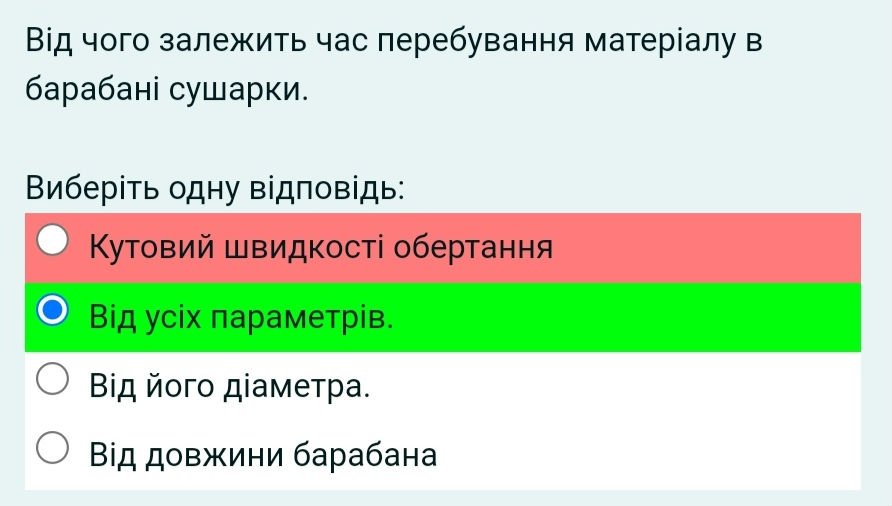

# Moodle-answer-collector (Userscript) (for Moodle v3.2 - 3.8.5)
Userscript to collect answers and help with questions on Moodle based sites

## Installing
> [Install](https://raw.githubusercontent.com/vladgba/Tsatu-answer-collector/master/script.user.js)

> **To install this script, you need to install an extension to run userscripts**

 [Tampermonkey](https://tampermonkey.net/) or [Greasemonkey](https://www.greasespot.net/) or [Violentmonkey](https://violentmonkey.github.io/get-it/) or different addon/extension to run userscripts.

Tampermonkey: 
- [Mozilla Firefox](https://addons.mozilla.org/firefox/addon/tampermonkey/)
- [Google Chrome](https://chrome.google.com/webstore/detail/tampermonkey/dhdgffkkebhmkfjojejmpbldmpobfkfo)
- [Opera](https://addons.opera.com/extensions/details/tampermonkey-beta/)
- [Apple Safari](https://tampermonkey.net/?ext=dhdg&browser=safari).
- [Dolphin](https://tampermonkey.net/?ext=dhdg&browser=dolphin).
- [UC Browser](https://tampermonkey.net/?ext=dhdg&browser=ucweb)

## How to use
 - After install you can see on moodle based site, at the top of page, "MDL-SET" button - this opens settings page.

 - Test passage looks like:
